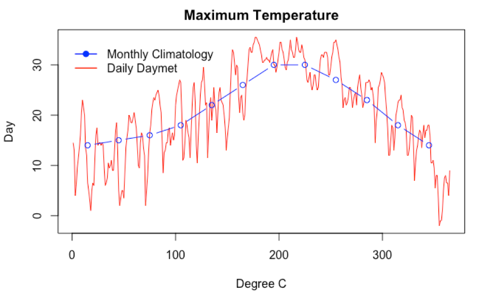

# Tutorial: Access Distributed NASA Earth Science Data from OPeNDAP Services using R
## Access time series of maximum temperature at an AmeriFlux site location
*Author: ORNL DAAC*
 
*Date: April 2, 2018*
 
*Contact for [ORNL DAAC](https://daac.ornl.gov/): uso@daac.ornl.gov*

##### Keywords: OPeNDAP, THREDDS, R, Daymet, temperature, AmeriFlux, `ncdf4`

## Overview
In this tutorial, we will explore how to use ORNL DAAC data from THREDDS Data Server through OPeNDAP protocol using R. THREDDS is a web server that provides direct access to scientific data sets and OPeNDAP is a protocol that allows access to remote data without having to download the data. This example uses spatial subset of mamimum temporature in two datasets. The first dataset is [Daymet: Daily Surface Weather Data on a 1-km Grid for North America, Version 3](https://daac.ornl.gov/cgi-bin/dsviewer.pl?ds_id=1328). The second is a [global 30-year monthly climatology dataset](https://daac.ornl.gov/cgi-bin/dsviewer.pl?ds_id=542). Both datasets are available through ORNL DAAC THREDDS server. We use ncdf4 library in R to access the data on THREDDS through OPenDAP protocol. The maximum temperature data and metadata are retrieved. The subsets of data are made based on the selected point of interest. At last, the maximum temperature of these two datasets are plotted.

## Source Data
Spatial subsets of daily maximum temperature data for North America in 1990 from Daymet version 3. The daily Daymet maximum temperature data is obtained from [this ORNL DAAC's THREDDS server.](https://thredds.daac.ornl.gov/thredds/catalog/ornldaac/1328/1990/catalog.html?dataset=1328/1990/daymet_v3_tmax_1990_na.nc4)
Spatial subsets of 30-year(1961-1990) mean monthly surface climat over global land areas, excluding Antarctica. In this example, monthly maimum temperature climatology data is obtained from [this ORNL DAAC's THREDDS server.](https://thredds.daac.ornl.gov/thredds/catalog/ornldaac/542/catalog.html?dataset=542/climate6190_TMX.nc4) 

## Prerequisites:
R v3.3 or later. R package: `ncdf4`

## Procedure
Access the tutorial here:  [Tutorial](opendap_r_v1.Rmd)
